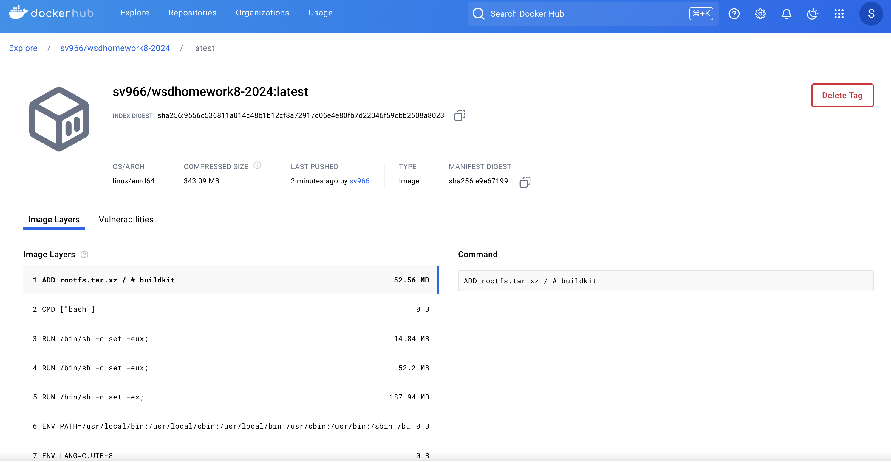
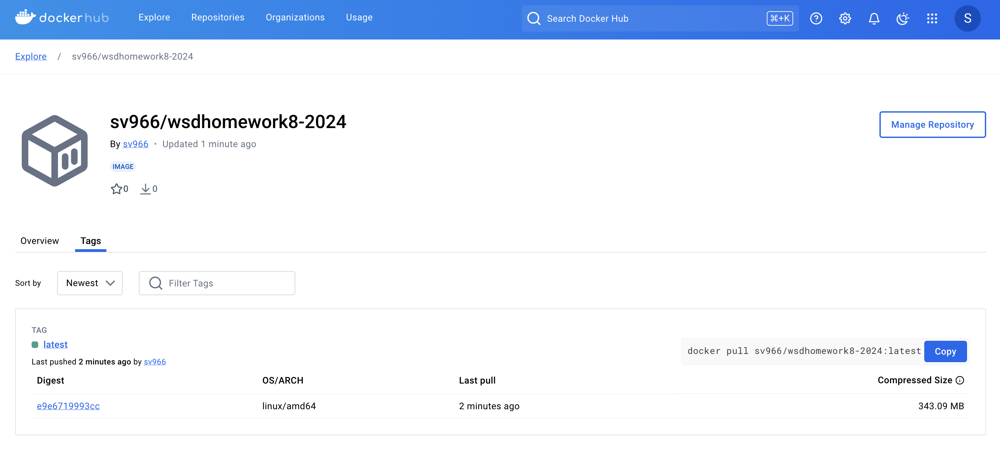

# wsdhomework8-2024

## Docker Image Build and Push

Building and pushing images to Docker Hub via GitHub Actions.

## Images

Below are the images that demonstrate various stages of the build process:

### Image 1: Image Layers

This image illustrates the layers of the Docker image during the build process.

### Image 2: Screenshot of the Build Process

This screenshot provides a detailed view of the build and push stages captured during the CI/CD pipeline execution.
